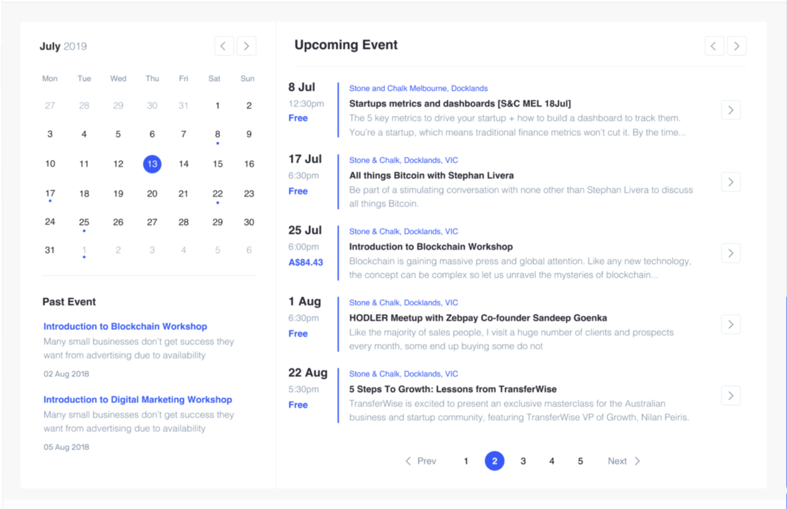

# Frontend Developer Interview Task - Event Calendar Component

Your task is to develop a small **Event Calendar** component using **React**. This resembles the type of project you'll be working on with us, and is aimed at assessing your skills in building functional, well-structured React components.

## Features to Implement

1. **Calendar Navigation**: Allow users to move between months.
2. **Highlight Events on Calendar**: Days with events should be highlighted.
3. **Upcoming and Past Events List**: Display events with details like title, date, time, location, and cost.
4. **Pagination**: Implement pagination for the event lists.
5. **Event Details Button**: Add a button for more event information (an alert or console log is fine).

## Design

## Requirements

- Use **React**. You may use any additional libraries for convenience.
- Implement the component to be **responsive**.
- The design should resemble the screenshot provided.
- Use **JavaScript** or **TypeScript**.

## What We Are Looking For

- **Code Quality**: Modular, readable, and documented.
- **State Management**: Efficiently handle state for events, calendar, etc.
- **Reusability**: Break down the UI into reusable components.
- **Responsiveness**: Adjust the layout for different screen sizes.
- **User Experience**: Intuitive UI and easy navigation.

## Getting Started

1. **Fork the Provided Sandbox**: Fork the CodeSandbox link provided to you.
2. **Develop the Component**: Implement the features listed above.
3. **Submit Your Work**: Share the link to your forked sandbox with us.

## Time Expectation

This task should take **up to 2 hours** to complete.

**Good luck!** 🚀
